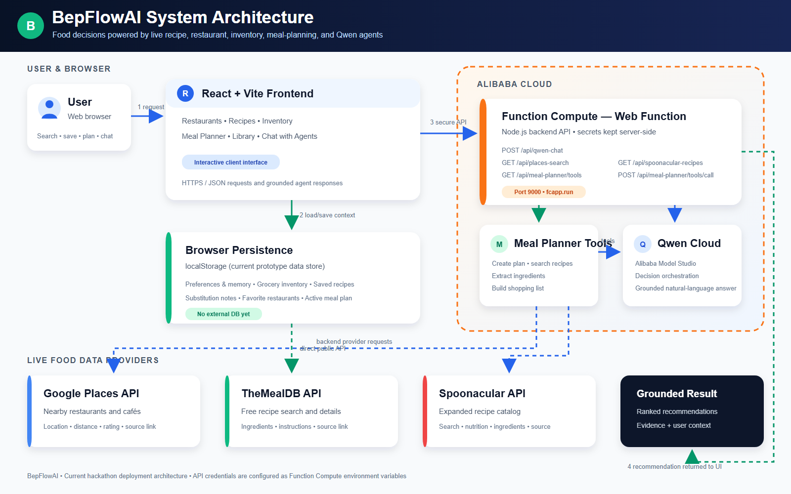

# BepFlowAI

BepFlowAI is a hackathon-focused multi-agent food decision dashboard.

The demo is intentionally narrow: help a user decide whether to eat at a restaurant, cook a recipe, or meal prep based on schedule, memory, cuisine preferences, budget, and available options.

## Architecture

[](./docs/bepflowai-architecture.png)

[Download the architecture diagram (PNG)](./docs/bepflowai-architecture.png) · [View or download the editable source (SVG)](./docs/bepflowai-architecture.svg)

The React frontend sends protected requests to the Node.js API hosted as an Alibaba Cloud Function Compute Web Function. Function Compute keeps provider credentials server-side, invokes Qwen through Alibaba Cloud Model Studio, and retrieves Google Places and Spoonacular data. TheMealDB's public API is called directly by the frontend. User preferences, inventory, saved recipes, restaurants, and meal plans are currently persisted in browser `localStorage`; an external database is not required for this prototype.

## App Tabs

- Restaurants: finds nearby restaurants and cafés through Google Places.
- Recipes: searches and combines recipes from TheMealDB and Spoonacular.
- Inventory: tracks grocery items and recommends recipes using available ingredients.
- Meal Planner: creates custom plans and extracts ingredients into a shopping list.
- Library: stores recipes, substitution notes, and favorite restaurants.
- Chat with Agents: lets the user prompt the Qwen orchestrator and review agent evidence.

## Agent System

- Decision Orchestrator: coordinates all agents and produces the final recommendation.
- Memory Agent: persists preferences, dislikes, budget, and feedback in `localStorage`.
- Restaurant Agent: uses Google Places when configured, otherwise demo restaurants.
- Recipe Agent: uses TheMealDB for recipe search.
- Schedule Agent: infers urgency and time available from the prompt.
- Budget Agent: checks the weekly budget.
- Decision Agent: scores restaurant, cook, and meal prep options.

## API Integration

TheMealDB works directly from the frontend, while Spoonacular runs through the local backend proxy so its key stays out of browser code. Add this to `.env`:

```bash
SPOONACULAR_API_KEY=your_spoonacular_key_here
```

The Recipes tab merges Spoonacular results with TheMealDB results. Restart `npm run api` after adding or changing the key.

Google Places runs through the backend proxy so its key stays out of browser code. Set:

```bash
GOOGLE_PLACES_API_KEY=your_key_here
```

For Alibaba Cloud deployment, add this and the other API keys as Function Compute environment variables rather than uploading `.env`.

Qwen chat runs through the local backend proxy in `server.mjs`, so `DASHSCOPE_API_KEY` stays out of browser code.

Set these in `.env`:

```bash
DASHSCOPE_API_KEY=your_dashscope_key_here
QWEN_MODEL=qwen3.5-flash
```

The chat endpoint is:

```text
POST /api/qwen-chat
```

The frontend sends the prompt plus current memory, restaurants, recipes, local decision scores, and agent evidence. Qwen acts as the Decision Orchestrator and returns:

```json
{
  "answer": "recommendation text",
  "agentNotes": ["Memory Agent: ...", "Restaurant Agent: ..."]
}
```

The orchestrator receives ranked candidates from both data agents:

- Restaurant Agent: Google Places candidates, scored by rating, travel time, source quality, and cuisine memory.
- Recipe Agent: TheMealDB candidates, scored by source quality, cuisine memory, and quick-cook fit.

Qwen is instructed to choose only from the provided restaurant and recipe candidates. If the requested city, cuisine, dish, or ingredient is missing from the current candidate data, it must say that clearly and recommend the closest available option instead of inventing one.

## Run Locally

```bash
npm install
npm run api
npm run dev
```

Run `npm run api` and `npm run dev` in separate terminals during local development.

## How Codex and GPT-5.6 Accelerated Development

Codex, powered by GPT-5.6, was used as an engineering collaborator throughout the OpenAI Build Week workflow. GPT-5.6 is not the model serving recommendations inside the deployed application; Qwen remains the runtime Decision Orchestrator. Codex/GPT-5.6 accelerated the development process around that runtime.

Codex helped with:

- Inspecting the React, Vite, Node.js, and Function Compute code paths to understand the generated application quickly.
- Diagnosing deployment failures, including Vercel expecting `build` instead of Vite's `dist` output and conflicting npm/pnpm installation metadata.
- Reproducing the Function Compute CORS failure and implementing both an origin allowlist and a Vercel same-origin API proxy.
- Designing and implementing Supabase authentication, Row Level Security policies, cloud-backed recipe and restaurant storage, and migration from browser `localStorage`.
- Preserving provider secrets on the server while connecting Vercel, Supabase, Alibaba Cloud Model Studio, Google Places, and Spoonacular.
- Running TypeScript checks and production builds after implementation changes.
- Improving the project documentation with setup instructions, demo credentials, testing guidance, architecture decisions, and judge-focused walkthroughs.

### Key decisions made with Codex assistance

- Keep the product focused on one explainable decision: restaurant versus cooking versus meal prep.
- Ground the orchestrator in supplied restaurant and recipe candidates instead of allowing invented recommendations.
- Keep Qwen, Places, and Spoonacular credentials inside Alibaba Function Compute.
- Use Supabase Auth and database-level Row Level Security for durable personal libraries.
- Retain `localStorage` as a migration and fallback layer rather than discarding existing demo data.
- Proxy production API requests through Vercel to avoid coupling browser CORS behavior to the Function Compute domain.

The product direction, provider choices, demo scope, and final implementation decisions remained human-directed. Codex/GPT-5.6 shortened the inspect–implement–test–document loop and made it possible to validate infrastructure and application changes within the Build Week timeline.

## Hackathon Scope

This demo skips authentication, payments, delivery, social features, coupons, restaurant ownership, and native mobile. The priority is a clear multi-agent workflow judges can understand in under three minutes.
